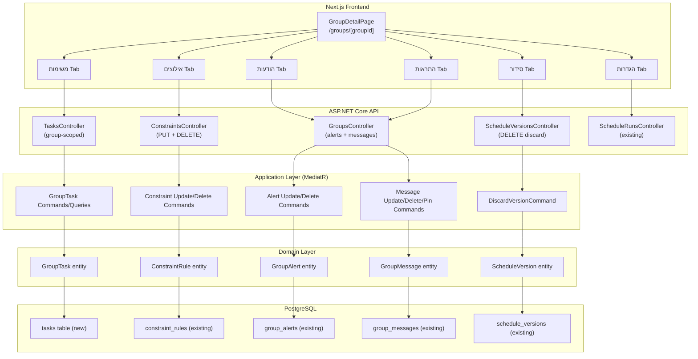
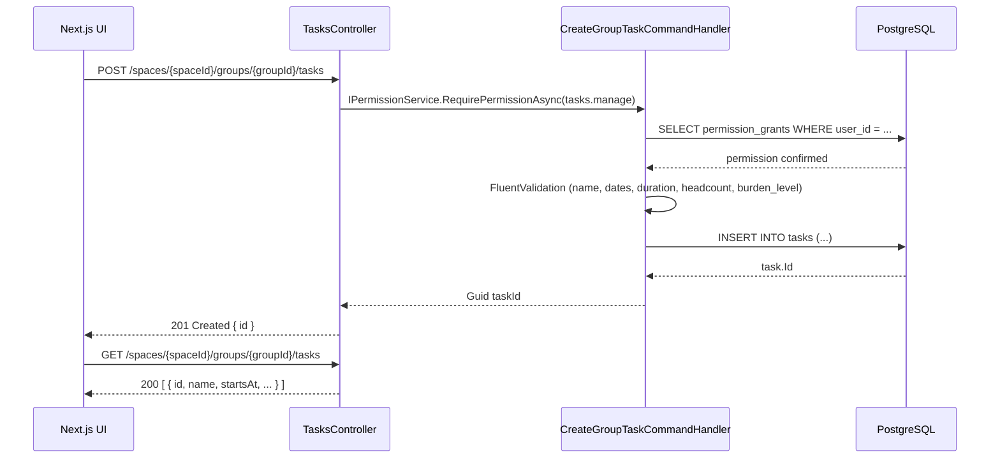
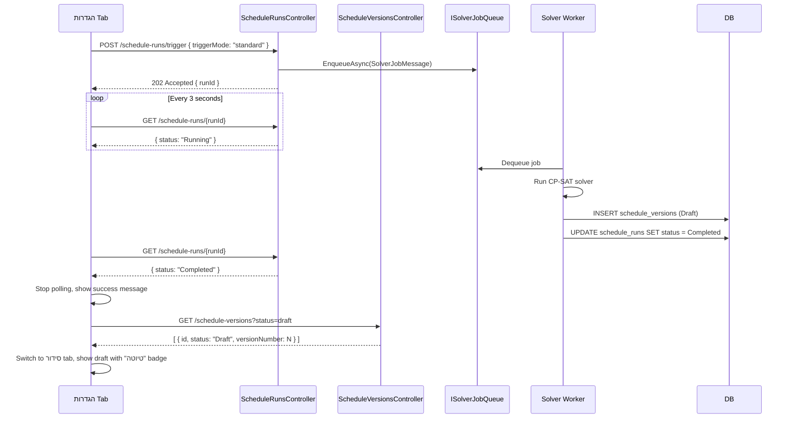
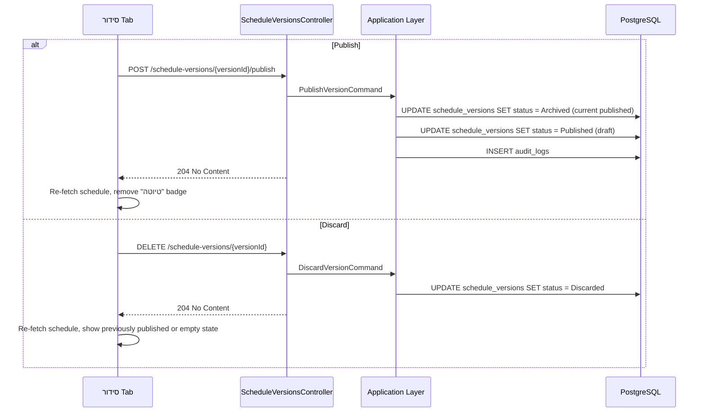

# Design Document: Admin Management and Scheduling

## Overview

This feature extends Jobuler with two coordinated parts:

**Part 1 — Admin CRUD Capabilities**: Introduces a new flat `GroupTask` domain entity (replacing the two-level `TaskType` + `TaskSlot` model for new functionality), adds full lifecycle management (create/edit/delete/list) for group-scoped tasks, adds edit and delete endpoints for constraints, and grants admins the ability to edit/delete/pin group messages and edit/delete group alerts without ownership restrictions.

**Part 2 — Scheduling Activation UI**: Adds a "הפעל סידור" (Activate Scheduling) section to the הגדרות tab in the GroupDetailPage. When triggered, the UI polls the solver run status every 3 seconds, then automatically refreshes the סידור tab to display the resulting draft version with publish/discard controls.

**Part 3 — DB Migration**: Migration 014 introduces the `tasks` table. The legacy `task_types` and `task_slots` tables are retained unchanged.

---

## Architecture

The system follows a strict 4-layer architecture. All new code respects the existing dependency flow:

```
Api → Application → Domain
Infrastructure → Application → Domain
```



---

## Components and Interfaces

### Backend Components

#### New: GroupTask Domain Entity
`apps/api/Jobuler.Domain/Tasks/GroupTask.cs`

New entity in the `Jobuler.Domain.Tasks` namespace. Implements `AuditableEntity` and `ITenantScoped`. Provides `Create()`, `Update()`, and `Deactivate()` factory/mutation methods.

#### New: GroupTask Application Commands/Queries
`apps/api/Jobuler.Application/Tasks/Commands/GroupTaskCommands.cs`
`apps/api/Jobuler.Application/Tasks/Queries/GetGroupTasksQuery.cs`

MediatR handlers for `CreateGroupTaskCommand`, `UpdateGroupTaskCommand`, `DeleteGroupTaskCommand`, and `GetGroupTasksQuery`. All permission checks via `IPermissionService`.

#### New: GroupTask EF Configuration
`apps/api/Jobuler.Infrastructure/Persistence/Configurations/GroupTaskConfiguration.cs`

Fluent API configuration for the `tasks` table. Maps all columns, configures the unique index on `(space_id, group_id, name)`, and sets up the CHECK constraint on `burden_level`.

#### Modified: AppDbContext
`apps/api/Jobuler.Application/Persistence/AppDbContext.cs`

Add `DbSet<GroupTask> GroupTasks` property.

#### New: Constraint Update/Delete Commands
`apps/api/Jobuler.Application/Constraints/Commands/UpdateConstraintCommand.cs`
`apps/api/Jobuler.Application/Constraints/Commands/DeleteConstraintCommand.cs`

MediatR handlers that call `ConstraintRule.Update()` and `ConstraintRule.Deactivate()` respectively. Both include FluentValidation validators.

#### Modified: ConstraintsController
`apps/api/Jobuler.Api/Controllers/ConstraintsController.cs`

Add `PUT /{constraintId}` and `DELETE /{constraintId}` actions.

#### Modified: GroupAlertCommands
`apps/api/Jobuler.Application/Groups/Commands/GroupAlertCommands.cs`

- Remove ownership check from `DeleteGroupAlertCommandHandler` (any `people.manage` holder can delete).
- Add `UpdateGroupAlertCommand` + handler + validator.

#### Modified: GroupAlert Domain Entity
`apps/api/Jobuler.Domain/Groups/GroupAlert.cs`

Add `Update(string title, string body, AlertSeverity severity)` method.

#### Modified: GroupMessageCommands
`apps/api/Jobuler.Application/Groups/Commands/GroupMessageCommands.cs`

- Update `DeleteGroupMessageCommandHandler` to allow deletion when caller holds `people.manage`.
- Add `UpdateGroupMessageCommand` + handler + validator.
- Add `PinGroupMessageCommand` + handler.

#### Modified: GroupsController (alerts + messages)
`apps/api/Jobuler.Api/Controllers/GroupsController.cs`

Add:
- `PUT /spaces/{spaceId}/groups/{groupId}/alerts/{alertId}`
- `PUT /spaces/{spaceId}/groups/{groupId}/messages/{messageId}`
- `PATCH /spaces/{spaceId}/groups/{groupId}/messages/{messageId}/pin`

#### New: DiscardVersionCommand
`apps/api/Jobuler.Application/Scheduling/Commands/DiscardVersionCommand.cs`

MediatR handler that sets a draft `ScheduleVersion` status to `Discarded`. Enforces draft-only rule.

#### Modified: ScheduleVersion Domain Entity
`apps/api/Jobuler.Domain/Scheduling/ScheduleVersion.cs`

Add `Discarded` to `ScheduleVersionStatus` enum and add `Discard()` method.

#### Modified: ScheduleVersionsController
`apps/api/Jobuler.Api/Controllers/ScheduleVersionsController.cs`

Add `DELETE /{versionId}` action for discarding draft versions.

#### New: DB Migration 014
`infra/migrations/014_group_tasks.sql`

Creates the `tasks` table with all required columns, indexes, RLS policy, and updated-at trigger.

### Frontend Components

#### Modified: GroupDetailPage
`apps/web/app/groups/[groupId]/page.tsx`

The 1586-line page component is modified per-tab as described in the Frontend Component Changes section below.

#### Modified: tasks API client
`apps/web/lib/api/tasks.ts`

Add group-scoped task CRUD functions: `createGroupTask`, `updateGroupTask`, `deleteGroupTask`, `listGroupTasks`.

#### Modified: constraints API client
`apps/web/lib/api/constraints.ts`

Add `updateConstraint` and `deleteConstraint` functions.

#### Modified: groups API client
`apps/web/lib/api/groups.ts`

Add `updateGroupAlert`, `deleteGroupAlert`, `updateGroupMessage`, `deleteGroupMessage`, `pinGroupMessage` functions.

---

## Data Models

### GroupTask Domain Entity

```csharp
// apps/api/Jobuler.Domain/Tasks/GroupTask.cs
namespace Jobuler.Domain.Tasks;

public class GroupTask : AuditableEntity, ITenantScoped
{
    public Guid SpaceId { get; private set; }
    public Guid GroupId { get; private set; }
    public string Name { get; private set; } = default!;
    public DateTime StartsAt { get; private set; }
    public DateTime EndsAt { get; private set; }
    public decimal DurationHours { get; private set; }
    public int RequiredHeadcount { get; private set; } = 1;
    public TaskBurdenLevel BurdenLevel { get; private set; } = TaskBurdenLevel.Neutral;
    public bool AllowsDoubleShift { get; private set; } = false;
    public bool AllowsOverlap { get; private set; } = false;
    public bool IsActive { get; private set; } = true;
    public Guid? CreatedByUserId { get; private set; }
    public Guid? UpdatedByUserId { get; private set; }

    private GroupTask() { }

    public static GroupTask Create(
        Guid spaceId, Guid groupId, string name,
        DateTime startsAt, DateTime endsAt, decimal durationHours,
        int requiredHeadcount, TaskBurdenLevel burdenLevel,
        bool allowsDoubleShift, bool allowsOverlap,
        Guid createdByUserId) => new()
    {
        SpaceId = spaceId,
        GroupId = groupId,
        Name = name.Trim(),
        StartsAt = startsAt,
        EndsAt = endsAt,
        DurationHours = durationHours,
        RequiredHeadcount = requiredHeadcount,
        BurdenLevel = burdenLevel,
        AllowsDoubleShift = allowsDoubleShift,
        AllowsOverlap = allowsOverlap,
        CreatedByUserId = createdByUserId
    };

    public void Update(
        string name, DateTime startsAt, DateTime endsAt,
        decimal durationHours, int requiredHeadcount,
        TaskBurdenLevel burdenLevel, bool allowsDoubleShift,
        bool allowsOverlap, Guid updatedByUserId)
    {
        Name = name.Trim();
        StartsAt = startsAt;
        EndsAt = endsAt;
        DurationHours = durationHours;
        RequiredHeadcount = requiredHeadcount;
        BurdenLevel = burdenLevel;
        AllowsDoubleShift = allowsDoubleShift;
        AllowsOverlap = allowsOverlap;
        UpdatedByUserId = updatedByUserId;
        Touch();
    }

    public void Deactivate(Guid updatedByUserId)
    {
        IsActive = false;
        UpdatedByUserId = updatedByUserId;
        Touch();
    }
}
```

### GroupTask DTO

```csharp
public record GroupTaskDto(
    Guid Id,
    string Name,
    DateTime StartsAt,
    DateTime EndsAt,
    decimal DurationHours,
    int RequiredHeadcount,
    string BurdenLevel,
    bool AllowsDoubleShift,
    bool AllowsOverlap,
    DateTime CreatedAt,
    DateTime UpdatedAt);
```

### ScheduleVersion — Discarded Status

The `ScheduleVersionStatus` enum gains a `Discarded` value:

```csharp
public enum ScheduleVersionStatus { Draft, Published, RolledBack, Archived, Discarded }
```

The `ScheduleVersion` entity gains:

```csharp
public void Discard()
{
    if (Status != ScheduleVersionStatus.Draft)
        throw new InvalidOperationException("Only draft versions can be discarded.");
    Status = ScheduleVersionStatus.Discarded;
}
```

### DB Schema — tasks table

```sql
CREATE TABLE tasks (
    id                   UUID PRIMARY KEY DEFAULT uuid_generate_v4(),
    space_id             UUID NOT NULL REFERENCES spaces(id) ON DELETE CASCADE,
    group_id             UUID NOT NULL REFERENCES groups(id) ON DELETE CASCADE,
    name                 TEXT NOT NULL,
    starts_at            TIMESTAMPTZ NOT NULL,
    ends_at              TIMESTAMPTZ NOT NULL,
    duration_hours       DECIMAL(6,2) NOT NULL,
    required_headcount   INT NOT NULL DEFAULT 1,
    burden_level         VARCHAR(20) NOT NULL DEFAULT 'neutral',
    allows_double_shift  BOOLEAN NOT NULL DEFAULT FALSE,
    allows_overlap       BOOLEAN NOT NULL DEFAULT FALSE,
    is_active            BOOLEAN NOT NULL DEFAULT TRUE,
    created_by_user_id   UUID REFERENCES users(id),
    updated_by_user_id   UUID REFERENCES users(id),
    created_at           TIMESTAMPTZ NOT NULL DEFAULT NOW(),
    updated_at           TIMESTAMPTZ NOT NULL DEFAULT NOW(),
    CONSTRAINT chk_task_ends_after_starts CHECK (ends_at > starts_at),
    CONSTRAINT chk_task_duration_positive CHECK (duration_hours > 0),
    CONSTRAINT chk_task_headcount_positive CHECK (required_headcount >= 1),
    CONSTRAINT chk_task_burden_level CHECK (
        burden_level IN ('favorable', 'neutral', 'disliked', 'hated')
    ),
    UNIQUE (space_id, group_id, name)
);
```

---

## API Endpoints

### New Group-Scoped Task Endpoints

| Method | Route | Permission | Description |
|--------|-------|------------|-------------|
| `GET` | `/spaces/{spaceId}/groups/{groupId}/tasks` | `space.view` | List active tasks for group |
| `POST` | `/spaces/{spaceId}/groups/{groupId}/tasks` | `tasks.manage` | Create a new task |
| `PUT` | `/spaces/{spaceId}/groups/{groupId}/tasks/{taskId}` | `tasks.manage` | Update an existing task |
| `DELETE` | `/spaces/{spaceId}/groups/{groupId}/tasks/{taskId}` | `tasks.manage` | Soft-delete a task |

### New/Modified Constraint Endpoints

| Method | Route | Permission | Description |
|--------|-------|------------|-------------|
| `PUT` | `/spaces/{spaceId}/constraints/{constraintId}` | `constraints.manage` | Update constraint payload/dates |
| `DELETE` | `/spaces/{spaceId}/constraints/{constraintId}` | `constraints.manage` | Soft-delete constraint |

### New Alert/Message Admin Endpoints

| Method | Route | Permission | Description |
|--------|-------|------------|-------------|
| `PUT` | `/spaces/{spaceId}/groups/{groupId}/alerts/{alertId}` | `people.manage` | Edit alert title/body/severity |
| `PUT` | `/spaces/{spaceId}/groups/{groupId}/messages/{messageId}` | `people.manage` | Edit message content |
| `PATCH` | `/spaces/{spaceId}/groups/{groupId}/messages/{messageId}/pin` | `people.manage` | Pin or unpin a message |

### New Schedule Version Endpoint

| Method | Route | Permission | Description |
|--------|-------|------------|-------------|
| `DELETE` | `/spaces/{spaceId}/schedule-versions/{versionId}` | `schedule.publish` | Discard a draft version |

### Request/Response Shapes

**POST/PUT `/tasks`**
```json
{
  "name": "שמירת לילה",
  "startsAt": "2025-08-01T22:00:00Z",
  "endsAt": "2025-08-02T06:00:00Z",
  "durationHours": 8.0,
  "requiredHeadcount": 2,
  "burdenLevel": "disliked",
  "allowsDoubleShift": false,
  "allowsOverlap": false
}
```

**GET `/tasks` response item**
```json
{
  "id": "...",
  "name": "שמירת לילה",
  "startsAt": "2025-08-01T22:00:00Z",
  "endsAt": "2025-08-02T06:00:00Z",
  "durationHours": 8.0,
  "requiredHeadcount": 2,
  "burdenLevel": "disliked",
  "allowsDoubleShift": false,
  "allowsOverlap": false,
  "createdAt": "...",
  "updatedAt": "..."
}
```

**PUT `/constraints/{constraintId}`**
```json
{
  "rulePayloadJson": "{\"hours\": 10}",
  "effectiveFrom": "2025-08-01",
  "effectiveUntil": "2025-12-31"
}
```

**PUT `/alerts/{alertId}`**
```json
{
  "title": "עדכון חשוב",
  "body": "תוכן ההתראה המעודכן",
  "severity": "warning"
}
```

**PUT `/messages/{messageId}`**
```json
{
  "content": "תוכן ההודעה המעודכן"
}
```

**PATCH `/messages/{messageId}/pin`**
```json
{ "isPinned": true }
```

---

## Data Flow Diagrams

### Task CRUD Flow



### Solver Trigger + Polling Flow



### Publish/Discard Draft Flow



---

## Correctness Properties

*A property is a characteristic or behavior that should hold true across all valid executions of a system — essentially, a formal statement about what the system should do. Properties serve as the bridge between human-readable specifications and machine-verifiable correctness guarantees.*

### Property 1: Task creation round-trip

*For any* valid task input (any name 1–200 chars, any valid datetime pair where ends_at > starts_at, any positive duration_hours, any required_headcount ≥ 1, any valid burden_level), creating a task and then listing tasks for the group SHALL return a task with matching field values.

**Validates: Requirements 1.2, 4.2, 4.3**

### Property 2: Invalid task time window is rejected

*For any* task create or update request where `ends_at` ≤ `starts_at`, the system SHALL return HTTP 400.

**Validates: Requirements 1.4, 2.3**

### Property 3: Invalid burden_level is rejected

*For any* string that is not one of `favorable`, `neutral`, `disliked`, or `hated` (case-insensitive), a task create or update request using that value as `burden_level` SHALL return HTTP 400.

**Validates: Requirements 1.7, 2.3**

### Property 4: Deleted task does not appear in list

*For any* active task in a group, after a successful DELETE request, the task SHALL NOT appear in the response of `GET /spaces/{spaceId}/groups/{groupId}/tasks`.

**Validates: Requirements 3.2, 4.2**

### Property 5: Task list is ordered by starts_at ascending

*For any* set of active tasks in a group, the list endpoint SHALL return them ordered by `starts_at` ascending.

**Validates: Requirements 4.2**

### Property 6: Constraint update round-trip

*For any* valid constraint update (any well-formed JSON payload, any valid date range), updating a constraint and then fetching it SHALL return the updated `rule_payload_json`, `effective_from`, and `effective_until` values.

**Validates: Requirements 5.2, 7.1**

### Property 7: Invalid constraint payload is rejected

*For any* string that is not valid JSON, a constraint update request using that string as `rulePayloadJson` SHALL return HTTP 400.

**Validates: Requirements 5.5, 7.2**

### Property 8: Constraint effective date ordering is enforced

*For any* constraint update request where `effectiveUntil` is before `effectiveFrom`, the system SHALL return HTTP 400.

**Validates: Requirements 7.3**

### Property 9: Deleted constraint does not appear in active list

*For any* active constraint, after a successful DELETE request, the constraint SHALL NOT appear in the response of `GET /spaces/{spaceId}/constraints` (which filters `is_active = true`).

**Validates: Requirements 6.2**

### Property 10: Admin can delete any alert regardless of creator

*For any* group alert created by any user with `people.manage`, any other user with `people.manage` in the same space SHALL be able to delete it (DELETE returns 204, alert no longer retrievable).

**Validates: Requirements 8.1, 8.4**

### Property 11: Admin can delete any message regardless of author

*For any* group message authored by any user, any user with `people.manage` in the same space SHALL be able to delete it (DELETE returns 204, message no longer retrievable).

**Validates: Requirements 9.1, 9.4**

### Property 12: Pin/unpin round-trip

*For any* group message, pinning it (PATCH with `isPinned: true`) and then unpinning it (PATCH with `isPinned: false`) SHALL restore the message to its original unpinned state.

**Validates: Requirements 10.2, 10.3**

### Property 13: Alert update round-trip

*For any* valid alert update (any title 1–200 chars, any body 1–2000 chars, any valid severity), updating an alert and then fetching it SHALL return the updated `title`, `body`, and `severity` values.

**Validates: Requirements 17.2**

### Property 14: Message update round-trip

*For any* valid message content (any string 1–5000 non-blank chars), updating a message and then fetching it SHALL return the updated `content` value.

**Validates: Requirements 18.2**

### Property 15: Discard sets version status to Discarded

*For any* draft schedule version, after a successful DELETE (discard) request, the version's status SHALL be `Discarded` and it SHALL NOT appear in queries filtering for `Draft` versions.

**Validates: Requirements 15.1**

---

## Error Handling

All exceptions propagate to `ExceptionHandlingMiddleware` per the existing convention:

| Exception | HTTP Status |
|-----------|-------------|
| `UnauthorizedAccessException` | 403 Forbidden |
| `KeyNotFoundException` | 404 Not Found |
| `InvalidOperationException` | 400 Bad Request |
| `ValidationException` (FluentValidation) | 400 Bad Request |

### Domain-level guards

- `GroupTask.Create()` — no domain-level throws; validation is in FluentValidation before the command reaches the handler.
- `GroupTask.Update()` — same; validation in FluentValidation.
- `ScheduleVersion.Discard()` — throws `InvalidOperationException("Only draft versions can be discarded.")` if status ≠ Draft → maps to 400.
- `ConstraintRule.Update()` — no domain throws; validation in FluentValidation.
- `ConstraintRule.Deactivate()` — idempotent; no throws.

### Frontend error handling

All API calls in the GroupDetailPage are wrapped in try/catch. On error, the Hebrew error message from the API response body (or a generic fallback) is displayed inline below the relevant form or action button.

---

## Testing Strategy

### Unit Tests

Unit tests cover specific examples, edge cases, and error conditions:

- `GroupTask.Create()` with valid inputs produces correct field values.
- `GroupTask.Deactivate()` sets `IsActive = false`.
- `ScheduleVersion.Discard()` throws when status is not Draft.
- `ScheduleVersion.Discard()` succeeds when status is Draft.
- `GroupAlert.Update()` trims whitespace from title and body.
- `DeleteGroupAlertCommandHandler` — no ownership check, any `people.manage` holder can delete.
- `DeleteGroupMessageCommandHandler` — `people.manage` holder can delete any message.
- `PinGroupMessageCommandHandler` — sets `IsPinned` correctly for both true and false.
- `UpdateConstraintCommandValidator` — rejects invalid JSON, rejects `effectiveUntil < effectiveFrom`.
- `CreateGroupTaskCommandValidator` — rejects empty name, name > 200 chars, whitespace-only name, `ends_at <= starts_at`, `duration_hours <= 0`, `required_headcount < 1`, invalid `burden_level`.

### Property-Based Tests

Property-based tests use a PBT library appropriate for the target language (e.g., **FsCheck** for .NET or **fast-check** for TypeScript frontend tests). Each test runs a minimum of **100 iterations**.

Each test is tagged with a comment in the format:
`// Feature: admin-management-and-scheduling, Property {N}: {property_text}`

- **Property 1**: Generate random valid task inputs → create → list → verify fields match.
- **Property 2**: Generate random datetime pairs where `ends_at ≤ starts_at` → create/update → verify 400.
- **Property 3**: Generate random strings not in `{favorable, neutral, disliked, hated}` → create/update → verify 400.
- **Property 4**: Create task → delete → list → verify absent.
- **Property 5**: Create N tasks with random `starts_at` values → list → verify ascending order.
- **Property 6**: Create constraint → generate random valid update → PUT → GET → verify fields match.
- **Property 7**: Generate random non-JSON strings → PUT constraint → verify 400.
- **Property 8**: Generate random date pairs where `until < from` → PUT constraint → verify 400.
- **Property 9**: Create constraint → delete → list → verify absent.
- **Property 10**: Create alert as user A → delete as user B (both `people.manage`) → verify 204 and alert gone.
- **Property 11**: Create message as user A → delete as user B (`people.manage`) → verify 204 and message gone.
- **Property 12**: Create message → pin → unpin → verify `isPinned = false`.
- **Property 13**: Create alert → generate random valid update → PUT → GET → verify fields match.
- **Property 14**: Create message → generate random valid content → PUT → GET → verify content matches.
- **Property 15**: Create draft version → DELETE → verify status = Discarded, not in draft list.

### Integration Tests

- Migration 014 applies cleanly on top of migration 013.
- Unique constraint on `(space_id, group_id, name)` is enforced at DB level.
- `burden_level` CHECK constraint rejects invalid values at DB level.
- `ScheduleRunsController.Trigger` → `ScheduleRunsController.GetRun` returns a valid run record.
- `ScheduleVersionsController.Publish` archives the previous published version.
