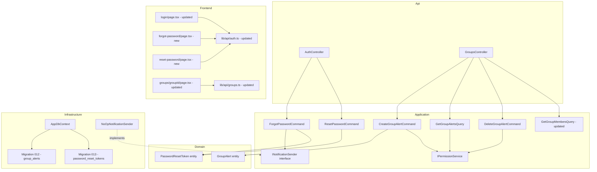

# Design Document — Group Alerts and Phone

## Overview

This feature delivers three coordinated additions to Jobuler:

1. **Phone number in `GroupMemberDto`** — No new migration needed; the `phone_number` column already exists on `people` from migration 010. The change is purely a projection update in `GetGroupMembersQuery` and a DTO field addition.

2. **Group Alerts tab ("התראות")** — A new `group_alerts` table (migration 012), a `GroupAlert` domain entity, three Application-layer commands/queries, two new controller endpoints, and a new "התראות" tab on the group detail page. Alerts are admin-only broadcasts with severity levels; they are explicitly not the same as `GroupMessages` (which are chat-like). Admins can post and delete their own alerts; members can only read.

3. **Forgot Password** — A `password_reset_tokens` table (migration 013), a new `INotificationSender` interface with `NoOpNotificationSender`, `ForgotPasswordCommand`, `ResetPasswordCommand`, two new `AuthController` endpoints, two new frontend pages (`/forgot-password`, `/reset-password`), and a "שכחת סיסמה?" link on the login page.

### Key Design Decisions

- **`INotificationSender` vs `IEmailSender`**: `INotificationSender` is a new interface specifically for user-facing notifications (password reset). `IEmailSender` stays for system emails (ownership transfer). This keeps concerns separate and allows WhatsApp/SMS wiring later without touching `IEmailSender` consumers.
- **Reset token security**: Raw 64-char hex is sent to the user; only its SHA-256 hash is stored in the DB. Plain tokens are never persisted.
- **`NoOpNotificationSender` logs at Warning** (not Debug) so the token is visible in dev console without extra log-level configuration.
- **Migration 012 is `group_alerts`** — migration 011 is `group_messages` (renamed from a duplicate 010). The numbering must not be reused.
- **Alerts ≠ GroupMessages** — `GroupMessages` are a chat-like feature with pinning and author-based deletion. `GroupAlerts` are admin-only broadcasts with severity levels and no reply capability.

---

## Architecture

```
Api → Application → Domain
Infrastructure → Application → Domain
```



---

## Components and Interfaces

### Migration 012 — `group_alerts`

File: `infra/migrations/012_group_alerts.sql`

```sql
CREATE TABLE IF NOT EXISTS group_alerts (
    id                   UUID PRIMARY KEY DEFAULT uuid_generate_v4(),
    space_id             UUID NOT NULL REFERENCES spaces(id) ON DELETE CASCADE,
    group_id             UUID NOT NULL REFERENCES groups(id) ON DELETE CASCADE,
    title                VARCHAR(200) NOT NULL,
    body                 TEXT NOT NULL,
    severity             VARCHAR(20) NOT NULL,
    created_at           TIMESTAMPTZ NOT NULL DEFAULT now(),
    created_by_person_id UUID NOT NULL REFERENCES people(id)
);

CREATE INDEX IF NOT EXISTS idx_group_alerts_group
    ON group_alerts (space_id, group_id, created_at DESC);
```

### Migration 013 — `password_reset_tokens`

File: `infra/migrations/013_password_reset_tokens.sql`

```sql
CREATE TABLE IF NOT EXISTS password_reset_tokens (
    id         UUID PRIMARY KEY DEFAULT uuid_generate_v4(),
    user_id    UUID NOT NULL REFERENCES users(id) ON DELETE CASCADE,
    token_hash TEXT NOT NULL UNIQUE,
    created_at TIMESTAMPTZ NOT NULL DEFAULT now(),
    expires_at TIMESTAMPTZ NOT NULL,
    used_at    TIMESTAMPTZ
);

CREATE INDEX IF NOT EXISTS idx_prt_user_id    ON password_reset_tokens (user_id);
CREATE INDEX IF NOT EXISTS idx_prt_token_hash ON password_reset_tokens (token_hash);
```

---

## Data Models

### `group_alerts` table

| Column | Type | Notes |
|--------|------|-------|
| `id` | UUID PK | |
| `space_id` | UUID FK → spaces | tenant scope |
| `group_id` | UUID FK → groups | |
| `title` | VARCHAR(200) NOT NULL | 1–200 chars |
| `body` | TEXT NOT NULL | 1–2000 chars (enforced in app layer) |
| `severity` | VARCHAR(20) NOT NULL | `info` \| `warning` \| `critical` |
| `created_at` | TIMESTAMPTZ NOT NULL DEFAULT now() | |
| `created_by_person_id` | UUID FK → people | |

### `password_reset_tokens` table

| Column | Type | Notes |
|--------|------|-------|
| `id` | UUID PK | |
| `user_id` | UUID FK → users | |
| `token_hash` | TEXT NOT NULL UNIQUE | SHA-256 of raw token |
| `created_at` | TIMESTAMPTZ NOT NULL DEFAULT now() | |
| `expires_at` | TIMESTAMPTZ NOT NULL | `created_at + 1 hour` |
| `used_at` | TIMESTAMPTZ nullable | set on successful reset |

### Domain Entities

#### `GroupAlert` (new)

```csharp
// Jobuler.Domain/Groups/GroupAlert.cs
public class GroupAlert : Entity, ITenantScoped
{
    public Guid SpaceId { get; private set; }
    public Guid GroupId { get; private set; }
    public string Title { get; private set; } = default!;
    public string Body { get; private set; } = default!;
    public AlertSeverity Severity { get; private set; }
    public DateTime CreatedAt { get; private set; }
    public Guid CreatedByPersonId { get; private set; }

    private GroupAlert() { }

    public static GroupAlert Create(
        Guid spaceId, Guid groupId,
        string title, string body,
        AlertSeverity severity, Guid createdByPersonId) =>
        new()
        {
            SpaceId = spaceId,
            GroupId = groupId,
            Title = title.Trim(),
            Body = body.Trim(),
            Severity = severity,
            CreatedAt = DateTime.UtcNow,
            CreatedByPersonId = createdByPersonId
        };
}

public enum AlertSeverity { Info, Warning, Critical }
```

#### `PasswordResetToken` (new)

```csharp
// Jobuler.Domain/Identity/PasswordResetToken.cs
public class PasswordResetToken : Entity
{
    public Guid UserId { get; private set; }
    public string TokenHash { get; private set; } = default!;
    public DateTime CreatedAt { get; private set; }
    public DateTime ExpiresAt { get; private set; }
    public DateTime? UsedAt { get; private set; }

    public bool IsExpired => DateTime.UtcNow > ExpiresAt;
    public bool IsUsed => UsedAt.HasValue;
    public bool IsValid => !IsExpired && !IsUsed;

    private PasswordResetToken() { }

    public static PasswordResetToken Create(Guid userId, string tokenHash) =>
        new()
        {
            UserId = userId,
            TokenHash = tokenHash,
            CreatedAt = DateTime.UtcNow,
            ExpiresAt = DateTime.UtcNow.AddHours(1)
        };

    public void MarkUsed() => UsedAt = DateTime.UtcNow;
}
```

### DTO Changes

#### `GroupMemberDto` (updated)

```csharp
// Jobuler.Application/Groups/Queries/GetGroupsQuery.cs
public record GroupMemberDto(
    Guid PersonId,
    string FullName,
    string? DisplayName,
    bool IsOwner,
    string? PhoneNumber);   // NEW — from people.phone_number
```

#### `GroupAlertDto` (new)

```csharp
public record GroupAlertDto(
    Guid Id,
    string Title,
    string Body,
    string Severity,
    DateTime CreatedAt,
    Guid CreatedByPersonId,
    string CreatedByDisplayName);
```

---

## Application Layer

### `INotificationSender` (new)

```csharp
// Jobuler.Application/Common/INotificationSender.cs
namespace Jobuler.Application.Common;

/// <summary>
/// Abstraction for user-facing notifications (password reset).
/// Separate from IEmailSender which handles system emails (ownership transfer).
/// Swap implementation in DI to enable WhatsApp, SMS, or real email delivery.
/// </summary>
public interface INotificationSender
{
    Task SendPasswordResetAsync(string to, string token, CancellationToken ct = default);
}
```

### `NoOpNotificationSender` (new)

```csharp
// Jobuler.Infrastructure/Notifications/NoOpNotificationSender.cs
public class NoOpNotificationSender : INotificationSender
{
    private readonly ILogger<NoOpNotificationSender> _logger;

    public NoOpNotificationSender(ILogger<NoOpNotificationSender> logger)
        => _logger = logger;

    public Task SendPasswordResetAsync(string to, string token, CancellationToken ct = default)
    {
        _logger.LogWarning(
            "[NoOp] Password reset for {To}: token={Token}",
            to, token);
        return Task.CompletedTask;
    }
}
```

Registered in DI: `services.AddScoped<INotificationSender, NoOpNotificationSender>();`

### Updated: `GetGroupMembersQuery`

The handler's LINQ projection gains `p.PhoneNumber`:

```csharp
.Select(p => new GroupMemberDto(p.Id, p.FullName, p.DisplayName, p.IsOwner, p.PhoneNumber))
```

No migration required — `phone_number` already exists on `people` from migration 010.

### New: `CreateGroupAlertCommand`

```csharp
// Jobuler.Application/Groups/Commands/GroupAlertCommands.cs
public record CreateGroupAlertCommand(
    Guid SpaceId, Guid GroupId, Guid RequestingUserId,
    string Title, string Body, string Severity) : IRequest<Guid>;

public class CreateGroupAlertCommandHandler : IRequestHandler<CreateGroupAlertCommand, Guid>
{
    private readonly AppDbContext _db;
    private readonly IPermissionService _permissions;

    public CreateGroupAlertCommandHandler(AppDbContext db, IPermissionService permissions)
    {
        _db = db;
        _permissions = permissions;
    }

    public async Task<Guid> Handle(CreateGroupAlertCommand req, CancellationToken ct)
    {
        await _permissions.RequirePermissionAsync(req.RequestingUserId, req.SpaceId, "people.manage", ct);

        if (!Enum.TryParse<AlertSeverity>(req.Severity, ignoreCase: true, out var severity))
            throw new InvalidOperationException($"Invalid severity '{req.Severity}'. Must be info, warning, or critical.");

        var person = await _db.People
            .FirstOrDefaultAsync(p => p.SpaceId == req.SpaceId && p.LinkedUserId == req.RequestingUserId, ct)
            ?? throw new InvalidOperationException("No linked person found for this user in the space.");

        var alert = GroupAlert.Create(req.SpaceId, req.GroupId, req.Title, req.Body, severity, person.Id);
        _db.GroupAlerts.Add(alert);
        await _db.SaveChangesAsync(ct);
        return alert.Id;
    }
}
```

Validator:

```csharp
public class CreateGroupAlertCommandValidator : AbstractValidator<CreateGroupAlertCommand>
{
    public CreateGroupAlertCommandValidator()
    {
        RuleFor(x => x.Title)
            .NotEmpty().MaximumLength(200)
            .Must(t => !string.IsNullOrWhiteSpace(t))
            .WithMessage("Title must be between 1 and 200 non-blank characters.");

        RuleFor(x => x.Body)
            .NotEmpty().MaximumLength(2000)
            .Must(b => !string.IsNullOrWhiteSpace(b))
            .WithMessage("Body must be between 1 and 2000 non-blank characters.");

        RuleFor(x => x.Severity)
            .NotEmpty()
            .Must(s => new[] { "info", "warning", "critical" }.Contains(s.ToLowerInvariant()))
            .WithMessage("Severity must be info, warning, or critical.");
    }
}
```

### New: `GetGroupAlertsQuery`

```csharp
public record GetGroupAlertsQuery(Guid SpaceId, Guid GroupId, Guid RequestingUserId)
    : IRequest<List<GroupAlertDto>>;

public class GetGroupAlertsQueryHandler : IRequestHandler<GetGroupAlertsQuery, List<GroupAlertDto>>
{
    private readonly AppDbContext _db;

    public GetGroupAlertsQueryHandler(AppDbContext db) => _db = db;

    public async Task<List<GroupAlertDto>> Handle(GetGroupAlertsQuery req, CancellationToken ct)
    {
        // Verify caller is a member of the group
        var isMember = await _db.GroupMemberships
            .Join(_db.People, m => m.PersonId, p => p.Id, (m, p) => new { m, p })
            .AnyAsync(x => x.m.GroupId == req.GroupId
                        && x.m.SpaceId == req.SpaceId
                        && x.p.LinkedUserId == req.RequestingUserId, ct);

        if (!isMember)
            throw new UnauthorizedAccessException("You are not a member of this group.");

        return await _db.GroupAlerts.AsNoTracking()
            .Where(a => a.GroupId == req.GroupId && a.SpaceId == req.SpaceId)
            .Join(_db.People, a => a.CreatedByPersonId, p => p.Id,
                (a, p) => new GroupAlertDto(
                    a.Id, a.Title, a.Body,
                    a.Severity.ToString().ToLowerInvariant(),
                    a.CreatedAt,
                    a.CreatedByPersonId,
                    p.DisplayName ?? p.FullName))
            .OrderByDescending(a => a.CreatedAt)
            .ToListAsync(ct);
    }
}
```

### New: `DeleteGroupAlertCommand`

```csharp
public record DeleteGroupAlertCommand(
    Guid SpaceId, Guid GroupId, Guid AlertId, Guid RequestingUserId) : IRequest;

public class DeleteGroupAlertCommandHandler : IRequestHandler<DeleteGroupAlertCommand>
{
    private readonly AppDbContext _db;
    private readonly IPermissionService _permissions;

    public DeleteGroupAlertCommandHandler(AppDbContext db, IPermissionService permissions)
    {
        _db = db;
        _permissions = permissions;
    }

    public async Task Handle(DeleteGroupAlertCommand req, CancellationToken ct)
    {
        await _permissions.RequirePermissionAsync(req.RequestingUserId, req.SpaceId, "people.manage", ct);

        var alert = await _db.GroupAlerts
            .FirstOrDefaultAsync(a => a.Id == req.AlertId
                                   && a.GroupId == req.GroupId
                                   && a.SpaceId == req.SpaceId, ct)
            ?? throw new KeyNotFoundException("Alert not found.");

        var callerPerson = await _db.People
            .FirstOrDefaultAsync(p => p.SpaceId == req.SpaceId && p.LinkedUserId == req.RequestingUserId, ct)
            ?? throw new InvalidOperationException("No linked person found for this user in the space.");

        if (alert.CreatedByPersonId != callerPerson.Id)
            throw new UnauthorizedAccessException("You can only delete alerts you created.");

        _db.GroupAlerts.Remove(alert);
        await _db.SaveChangesAsync(ct);
    }
}
```

### New: `ForgotPasswordCommand`

```csharp
// Jobuler.Application/Auth/Commands/ForgotPasswordCommand.cs
public record ForgotPasswordCommand(string Email) : IRequest;

public class ForgotPasswordCommandHandler : IRequestHandler<ForgotPasswordCommand>
{
    private readonly AppDbContext _db;
    private readonly INotificationSender _notifications;
    private readonly IJwtService _jwt;  // reuse HashToken helper

    public ForgotPasswordCommandHandler(
        AppDbContext db, INotificationSender notifications, IJwtService jwt)
    {
        _db = db;
        _notifications = notifications;
        _jwt = jwt;
    }

    public async Task Handle(ForgotPasswordCommand req, CancellationToken ct)
    {
        var user = await _db.Users
            .FirstOrDefaultAsync(u => u.Email == req.Email.ToLowerInvariant().Trim() && u.IsActive, ct);

        // Always return without error — never reveal whether email exists
        if (user is null) return;

        // Invalidate any existing active token for this user
        var existing = await _db.PasswordResetTokens
            .Where(t => t.UserId == user.Id && t.UsedAt == null && t.ExpiresAt > DateTime.UtcNow)
            .ToListAsync(ct);
        foreach (var t in existing)
            t.MarkUsed();

        // Generate raw token and store only its hash
        var rawToken = _jwt.GenerateRefreshTokenRaw(); // 64-char hex via RandomNumberGenerator
        var tokenHash = _jwt.HashToken(rawToken);      // SHA-256

        var resetToken = PasswordResetToken.Create(user.Id, tokenHash);
        _db.PasswordResetTokens.Add(resetToken);
        await _db.SaveChangesAsync(ct);

        // Deliver via INotificationSender — prefer phone, fall back to email
        var to = !string.IsNullOrWhiteSpace(user.PhoneNumber) ? user.PhoneNumber : user.Email;
        await _notifications.SendPasswordResetAsync(to, rawToken, ct);
    }
}
```

### New: `ResetPasswordCommand`

```csharp
// Jobuler.Application/Auth/Commands/ResetPasswordCommand.cs
public record ResetPasswordCommand(string Token, string NewPassword) : IRequest;

public class ResetPasswordCommandHandler : IRequestHandler<ResetPasswordCommand>
{
    private readonly AppDbContext _db;
    private readonly IJwtService _jwt;

    public ResetPasswordCommandHandler(AppDbContext db, IJwtService jwt)
    {
        _db = db;
        _jwt = jwt;
    }

    public async Task Handle(ResetPasswordCommand req, CancellationToken ct)
    {
        if (req.NewPassword.Length < 8)
            throw new InvalidOperationException("Password must be at least 8 characters.");

        var tokenHash = _jwt.HashToken(req.Token);

        var resetToken = await _db.PasswordResetTokens
            .FirstOrDefaultAsync(t => t.TokenHash == tokenHash, ct);

        if (resetToken is null || !resetToken.IsValid)
            throw new InvalidOperationException("Invalid or expired reset token.");

        var user = await _db.Users.FindAsync([resetToken.UserId], ct)
            ?? throw new KeyNotFoundException("User not found.");

        // Hash new password with BCrypt work factor 12
        user.SetPasswordHash(BCrypt.Net.BCrypt.HashPassword(req.NewPassword, workFactor: 12));

        // Mark token as used
        resetToken.MarkUsed();

        // Revoke all existing refresh tokens for this user
        var refreshTokens = await _db.RefreshTokens
            .Where(rt => rt.UserId == user.Id && rt.RevokedAt == null)
            .ToListAsync(ct);
        foreach (var rt in refreshTokens)
            rt.Revoke();

        await _db.SaveChangesAsync(ct);
    }
}
```

Validator:

```csharp
public class ResetPasswordCommandValidator : AbstractValidator<ResetPasswordCommand>
{
    public ResetPasswordCommandValidator()
    {
        RuleFor(x => x.Token).NotEmpty();
        RuleFor(x => x.NewPassword).MinimumLength(8).WithMessage("Password must be at least 8 characters.");
    }
}
```

---

## API Endpoints

### `GroupsController` — new endpoints

| Method | Route | Auth | Handler |
|--------|-------|------|---------|
| `POST` | `/spaces/{spaceId}/groups/{groupId}/alerts` | `[Authorize]` | `CreateGroupAlertCommand` |
| `GET` | `/spaces/{spaceId}/groups/{groupId}/alerts` | `[Authorize]` | `GetGroupAlertsQuery` |
| `DELETE` | `/spaces/{spaceId}/groups/{groupId}/alerts/{alertId}` | `[Authorize]` | `DeleteGroupAlertCommand` |

```csharp
[HttpPost("{groupId}/alerts")]
public async Task<IActionResult> CreateAlert(
    Guid spaceId, Guid groupId,
    [FromBody] CreateAlertRequest req, CancellationToken ct)
{
    var id = await _mediator.Send(
        new CreateGroupAlertCommand(spaceId, groupId, CurrentUserId, req.Title, req.Body, req.Severity), ct);
    return CreatedAtAction(nameof(CreateAlert), new { id });
}

[HttpGet("{groupId}/alerts")]
public async Task<IActionResult> GetAlerts(Guid spaceId, Guid groupId, CancellationToken ct)
{
    var alerts = await _mediator.Send(new GetGroupAlertsQuery(spaceId, groupId, CurrentUserId), ct);
    return Ok(alerts);
}

[HttpDelete("{groupId}/alerts/{alertId}")]
public async Task<IActionResult> DeleteAlert(
    Guid spaceId, Guid groupId, Guid alertId, CancellationToken ct)
{
    await _mediator.Send(new DeleteGroupAlertCommand(spaceId, groupId, alertId, CurrentUserId), ct);
    return NoContent();
}

public record CreateAlertRequest(string Title, string Body, string Severity);
```

### `AuthController` — new endpoints

| Method | Route | Auth | Handler |
|--------|-------|------|---------|
| `POST` | `/auth/forgot-password` | `[AllowAnonymous]` | `ForgotPasswordCommand` |
| `POST` | `/auth/reset-password` | `[AllowAnonymous]` | `ResetPasswordCommand` |

```csharp
[HttpPost("forgot-password")]
[AllowAnonymous]
public async Task<IActionResult> ForgotPassword(
    [FromBody] ForgotPasswordRequest req, CancellationToken ct)
{
    await _mediator.Send(new ForgotPasswordCommand(req.Email), ct);
    return Ok();
}

[HttpPost("reset-password")]
[AllowAnonymous]
public async Task<IActionResult> ResetPassword(
    [FromBody] ResetPasswordRequest req, CancellationToken ct)
{
    await _mediator.Send(new ResetPasswordCommand(req.Token, req.NewPassword), ct);
    return NoContent();
}

public record ForgotPasswordRequest(string Email);
public record ResetPasswordRequest(string Token, string NewPassword);
```

---

## Frontend

### `lib/api/groups.ts` — updated

```typescript
export interface GroupMemberDto {
  personId: string;
  fullName: string;
  displayName: string | null;
  isOwner: boolean;
  phoneNumber: string | null;  // NEW
}

export interface GroupAlertDto {
  id: string;
  title: string;
  body: string;
  severity: "info" | "warning" | "critical";
  createdAt: string;
  createdByPersonId: string;
  createdByDisplayName: string;
}

// New API functions
export async function getGroupAlerts(spaceId: string, groupId: string): Promise<GroupAlertDto[]> {
  return apiClient.get(`/spaces/${spaceId}/groups/${groupId}/alerts`);
}

export async function createGroupAlert(
  spaceId: string, groupId: string,
  payload: { title: string; body: string; severity: string }
): Promise<{ id: string }> {
  return apiClient.post(`/spaces/${spaceId}/groups/${groupId}/alerts`, payload);
}

export async function deleteGroupAlert(
  spaceId: string, groupId: string, alertId: string
): Promise<void> {
  return apiClient.delete(`/spaces/${spaceId}/groups/${groupId}/alerts/${alertId}`);
}
```

### `lib/api/auth.ts` — updated

```typescript
export async function forgotPassword(email: string): Promise<void> {
  await fetch(`${API_BASE}/auth/forgot-password`, {
    method: "POST",
    headers: { "Content-Type": "application/json" },
    body: JSON.stringify({ email }),
  });
  // Always resolves — never throws on 200
}

export async function resetPassword(token: string, newPassword: string): Promise<void> {
  const res = await fetch(`${API_BASE}/auth/reset-password`, {
    method: "POST",
    headers: { "Content-Type": "application/json" },
    body: JSON.stringify({ token, newPassword }),
  });
  if (!res.ok) {
    const body = await res.json().catch(() => ({}));
    throw new Error(body.message ?? "שגיאה באיפוס הסיסמה");
  }
}
```

### Severity badge utility

```typescript
// lib/utils/alertSeverity.ts
export const SEVERITY_BADGE: Record<string, { bg: string; text: string; label: string }> = {
  info:     { bg: "bg-blue-50",  text: "text-blue-700",  label: "מידע" },
  warning:  { bg: "bg-amber-50", text: "text-amber-700", label: "אזהרה" },
  critical: { bg: "bg-red-50",   text: "text-red-700",   label: "קריטי" },
};
```

### `app/groups/[groupId]/page.tsx` — updated

**Tab list change**: Add `"alerts"` to the `ActiveTab` union and add a "התראות" tab button visible to all members (not gated by `adminGroupId`).

**Phone number in members tab**: In both read-only and admin-edit member rows, render `m.phoneNumber` as plain text after the display name. When `null`, render nothing (no "null" string).

**Alerts tab content**:
- Fetch `getGroupAlerts(spaceId, groupId)` when the tab becomes active
- Render each alert as a card with severity badge, title, body, `createdByDisplayName`, and formatted `createdAt`
- When `adminGroupId === groupId`, render a create-alert form at the top (title input, body textarea, severity `<select>`, submit button)
- When `adminGroupId === groupId`, render a delete button on each alert where `alert.createdByPersonId === currentPersonId`
- Empty state: "אין התראות לקבוצה זו"
- Error state: Hebrew error message

### `app/forgot-password/page.tsx` (new)

```
Route: /forgot-password
Auth: none (public page)

UI:
- Single email input
- Submit button: "שלח קישור לאיפוס"
- On submit: call forgotPassword(email), always show success message:
  "אם הכתובת רשומה במערכת, תקבל הודעה בקרוב."
- No error state exposed to user (prevents enumeration)
- Link back to /login
```

### `app/reset-password/page.tsx` (new)

```
Route: /reset-password?token=<raw_token>
Auth: none (public page)

UI:
- Read token from useSearchParams()
- New password input
- Confirm password input (client-side match validation only)
- Submit button: "אפס סיסמה"
- On success: router.push("/login?reset=1")
- On error: display Hebrew error message inline
```

### `app/login/page.tsx` — updated

Two additions:
1. "שכחת סיסמה?" link below the password field → `/forgot-password`
2. Success banner when `?reset=1` is in the URL: "הסיסמה אופסה בהצלחה! התחבר עם הסיסמה החדשה."

---


## Correctness Properties

*A property is a characteristic or behavior that should hold true across all valid executions of a system — essentially, a formal statement about what the system should do. Properties serve as the bridge between human-readable specifications and machine-verifiable correctness guarantees.*

### Property 1: Phone number in DTO matches people table

*For any* person in any group, the `phoneNumber` field in `GroupMemberDto` returned by `GetGroupMembersQuery` SHALL equal the `phone_number` value stored in the `people` table for that person, including `null` when no phone number is recorded.

**Validates: Requirements 1.1, 1.2, 1.3**

---

### Property 2: Phone number renders correctly for all members

*For any* list of `GroupMemberDto` objects with mixed `null` and non-null `phoneNumber` values, the rendered member list SHALL display the phone number string for non-null values and SHALL NOT render the strings `"null"` or `"undefined"` for null values.

**Validates: Requirements 2.1, 2.2, 2.5**

---

### Property 3: Alert creation round-trip

*For any* valid alert inputs (title 1–200 chars, body 1–2000 chars, severity one of `info`/`warning`/`critical`), after `CreateGroupAlertCommand` succeeds, calling `GetGroupAlertsQuery` for the same group SHALL return an alert whose `title`, `body`, and `severity` match the inputs exactly.

**Validates: Requirements 4.1, 5.1, 5.2**

---

### Property 4: Alert creation rejects invalid inputs

*For any* combination of invalid inputs — title that is blank or exceeds 200 characters, body that is blank or exceeds 2000 characters, or severity not in `{info, warning, critical}` — `CreateGroupAlertCommand` SHALL throw `InvalidOperationException` and no alert SHALL be persisted.

**Validates: Requirements 4.3, 4.4, 4.5**

---

### Property 5: Alerts are ordered newest-first

*For any* set of alerts in a group, `GetGroupAlertsQuery` SHALL return them in strictly descending order by `createdAt` — no two adjacent results SHALL have the earlier one appearing before the later one.

**Validates: Requirements 5.1**

---

### Property 6: Alerts respect tenant isolation

*For any* two spaces A and B each containing alerts for groups with the same `groupId` value, `GetGroupAlertsQuery` with `spaceId = A` SHALL never return alerts belonging to space B.

**Validates: Requirements 5.4**

---

### Property 7: Non-members cannot read alerts

*For any* group and *for any* user who is not a member of that group, `GetGroupAlertsQuery` SHALL throw `UnauthorizedAccessException`.

**Validates: Requirements 5.3**

---

### Property 8: Alert delete removes own alerts

*For any* alert created by person X, after `DeleteGroupAlertCommand` is called by person X with `people.manage` permission, `GetGroupAlertsQuery` SHALL no longer include that alert in its results.

**Validates: Requirements 6.1**

---

### Property 9: Alert delete rejects cross-owner deletion

*For any* alert created by person A, calling `DeleteGroupAlertCommand` as person B (where B ≠ A, even if B has `people.manage` permission) SHALL throw `UnauthorizedAccessException`.

**Validates: Requirements 6.3**

---

### Property 10: Severity badge color is correct for all severity values

*For any* `GroupAlertDto` with a `severity` value, the rendered severity badge SHALL apply the correct CSS classes: `info` → blue (`bg-blue-50 text-blue-700`), `warning` → amber (`bg-amber-50 text-amber-700`), `critical` → red (`bg-red-50 text-red-700`).

**Validates: Requirements 7.8**

---

### Property 11: Delete buttons appear only on own alerts

*For any* list of `GroupAlertDto` objects rendered in admin mode, delete buttons SHALL appear only on alerts where `alert.createdByPersonId === currentPersonId`, and SHALL NOT appear on any other alert.

**Validates: Requirements 9.1, 9.2**

---

### Property 12: Reset token hash is SHA-256 of raw token

*For any* user email that matches an active user, after `ForgotPasswordCommand` executes, the `token_hash` stored in `password_reset_tokens` SHALL equal `SHA256(rawToken)` where `rawToken` is the value delivered via `INotificationSender`, and `expires_at` SHALL be within 1 second of `created_at + 1 hour`.

**Validates: Requirements 12.2**

---

### Property 13: User enumeration prevention

*For any* email address that does not match any registered user, `ForgotPasswordCommand` SHALL complete without throwing any exception and SHALL NOT create any `password_reset_tokens` row.

**Validates: Requirements 12.3**

---

### Property 14: At most one active reset token per user

*For any* user, after calling `ForgotPasswordCommand` twice in succession, there SHALL be exactly one `password_reset_tokens` row for that user with `used_at IS NULL` and `expires_at > now()`, and the first token SHALL have `used_at` set.

**Validates: Requirements 12.4**

---

### Property 15: Invalid tokens are always rejected

*For any* token that is invalid — wrong hash (not in DB), expired (`expires_at < now()`), or already used (`used_at IS NOT NULL`) — `ResetPasswordCommand` SHALL throw `InvalidOperationException` with the message "Invalid or expired reset token." and the user's `password_hash` SHALL remain unchanged.

**Validates: Requirements 14.3, 14.4, 14.5**

---

### Property 16: Password reset produces valid BCrypt hash at work factor 12

*For any* valid token and new password of at least 8 characters, after `ResetPasswordCommand` succeeds, `BCrypt.Verify(newPassword, user.PasswordHash)` SHALL return `true` and the stored hash SHALL use work factor 12.

**Validates: Requirements 14.6**

---

### Property 17: Successful reset invalidates all refresh tokens

*For any* user with N active refresh tokens, after `ResetPasswordCommand` succeeds, all N refresh tokens SHALL have `revoked_at` set to a non-null value.

**Validates: Requirements 14.8**

---

### Property 18: Short passwords are rejected

*For any* string of length 0–7 characters, `ResetPasswordCommand` SHALL throw `InvalidOperationException` and the user's `password_hash` SHALL remain unchanged.

**Validates: Requirements 14.7**

---

## Error Handling

All exceptions propagate to `ExceptionHandlingMiddleware`:

| Exception | HTTP Status | Scenario |
|-----------|-------------|---------|
| `UnauthorizedAccessException` | 403 | Non-admin creates/deletes alert; non-member reads alerts; admin deletes another admin's alert |
| `KeyNotFoundException` | 404 | Alert not found; user not found during reset |
| `InvalidOperationException` | 400 | Invalid severity; blank title/body; no linked person; invalid/expired/used reset token; password too short |
| `ConflictException` | 409 | (not used in this feature — no uniqueness conflicts) |

### Frontend Error Handling

- All API errors in the alerts tab display inline Hebrew error messages
- `/forgot-password` never shows an error to the user — always shows the success message
- `/reset-password` shows the API error message in Hebrew on failure
- Network errors fall back to a generic "שגיאה" message

---

## Testing Strategy

### Unit Tests (example-based)

- `GetGroupMembersQueryHandler`: verify `PhoneNumber` is included in projection for persons with and without phone numbers
- `CreateGroupAlertCommandHandler`: verify 403 for non-admin, 400 for invalid severity, 400 for blank title/body, 201 for valid inputs
- `GetGroupAlertsQueryHandler`: verify 403 for non-member, empty array for group with no alerts, correct ordering
- `DeleteGroupAlertCommandHandler`: verify 403 for non-admin, 403 for cross-owner deletion, 404 for missing alert, 204 for valid deletion
- `ForgotPasswordCommandHandler`: verify no exception for unknown email, token hash stored correctly, existing token invalidated
- `ResetPasswordCommandHandler`: verify rejection of expired/used/wrong tokens, BCrypt hash updated, refresh tokens revoked
- `NoOpNotificationSender`: verify it logs at Warning level and does not throw
- `SEVERITY_BADGE` utility: verify correct classes for each of the three severity values
- Login page: snapshot test for "שכחת סיסמה?" link and `?reset=1` banner

### Property-Based Tests

Use **FsCheck** (C# / .NET) for backend properties and **fast-check** (TypeScript) for frontend properties. Each property test runs a minimum of **100 iterations**.

Tag format: `// Feature: group-alerts-and-phone, Property {N}: {property_text}`

| Property | Library | What varies |
|----------|---------|-------------|
| P1: Phone number DTO fidelity | FsCheck | Random persons with null/non-null phone numbers |
| P2: Phone number rendering | fast-check | Random GroupMemberDto arrays with mixed phoneNumber values |
| P3: Alert creation round-trip | FsCheck | Random valid title/body/severity combinations |
| P4: Alert creation rejects invalid inputs | FsCheck | Random invalid title lengths, body lengths, severity strings |
| P5: Alerts ordered newest-first | FsCheck | Random sets of alerts with random createdAt values |
| P6: Tenant isolation | FsCheck | Random alerts in two spaces with overlapping group IDs |
| P7: Non-members cannot read alerts | FsCheck | Random users not in the group |
| P8: Alert delete removes own alerts | FsCheck | Random alerts and their creators |
| P9: Cross-owner deletion rejected | FsCheck | Random alert/person pairs where person ≠ creator |
| P10: Severity badge color | fast-check | All three severity values (exhaustive) |
| P11: Delete buttons on own alerts only | fast-check | Random alert lists with mixed ownership |
| P12: Reset token hash integrity | FsCheck | Random user emails and generated tokens |
| P13: User enumeration prevention | FsCheck | Random non-existent email strings |
| P14: One active token per user | FsCheck | Random users, called twice |
| P15: Invalid tokens rejected | FsCheck | Random tokens in invalid states (wrong hash, past expiry, used) |
| P16: BCrypt work factor 12 | FsCheck | Random valid passwords (length ≥ 8) |
| P17: Refresh tokens revoked after reset | FsCheck | Random counts of active refresh tokens (1–20) |
| P18: Short passwords rejected | FsCheck | Random strings of length 0–7 |

### Integration Tests

- Migration 012 applies cleanly: `group_alerts` table exists with correct columns and index
- Migration 013 applies cleanly: `password_reset_tokens` table exists with correct columns and indexes
- `GET /spaces/{spaceId}/groups/{groupId}/members` returns `phoneNumber` field in response JSON
- `POST /auth/forgot-password` returns 200 for both existing and non-existing emails
- `POST /auth/reset-password` returns 204 on valid token, 400 on expired token
- `NoOpNotificationSender` resolves from DI and logs at Warning without throwing
- `INotificationSender` resolves to `NoOpNotificationSender` in default DI configuration

### Smoke Tests

- `group_alerts` table exists after migration 012
- `password_reset_tokens` table exists after migration 013
- `phone_number` column exists on `people` table (from migration 010 — no new migration)
- `INotificationSender` is registered in DI
- `/forgot-password` and `/reset-password` routes are accessible without authentication
