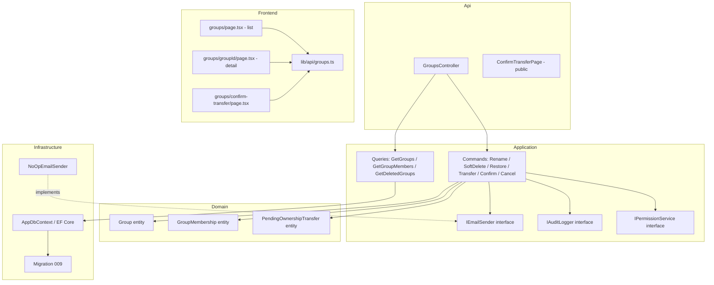

# Design Document — Group Ownership

## Overview

This feature introduces a formal ownership model for groups in Jobuler. Currently groups have no owner, the creator is not auto-added as a member, and any space admin can remove any member. This design adds:

- **Creator auto-membership** with `is_owner = true` in the same transaction as group creation
- **Owner-only management actions**: rename, soft-delete (with 30-day recovery), ownership transfer
- **Owner removal protection** enforced in the command handler
- **Group avatars** — deterministic colored circles with the group's first letter
- **Ownership transfer via email confirmation** with a 48-hour expiry window
- **`IEmailSender` abstraction** with a no-op default so email can be wired later
- **Dana** — a 5th seed user with no group memberships, for testing the add-by-email flow

The feature spans a database migration (009), domain entity changes, new Application-layer commands/queries, controller endpoints, and frontend UI additions.

---

## Architecture

The system follows a strict 4-layer architecture:

```
Api → Application → Domain
Infrastructure → Application → Domain
```



All ownership checks happen in Application-layer command handlers, never in controllers or the domain. Permission checks (`IPermissionService`) guard space-level access; ownership checks guard group-level owner-only actions.

---

## Components and Interfaces

### Database Migration 009

File: `infra/migrations/009_group_ownership.sql`

```sql
-- is_owner flag on group_memberships
ALTER TABLE group_memberships
    ADD COLUMN IF NOT EXISTS is_owner BOOLEAN NOT NULL DEFAULT false;

-- Unique partial index: at most one owner per group
CREATE UNIQUE INDEX IF NOT EXISTS uq_group_memberships_one_owner
    ON group_memberships (group_id)
    WHERE is_owner = true;

-- Soft-delete support on groups
ALTER TABLE groups
    ADD COLUMN IF NOT EXISTS deleted_at TIMESTAMPTZ;

CREATE INDEX IF NOT EXISTS idx_groups_deleted_at ON groups (deleted_at)
    WHERE deleted_at IS NOT NULL;

-- Pending ownership transfers
CREATE TABLE IF NOT EXISTS pending_ownership_transfers (
    id                      UUID PRIMARY KEY DEFAULT uuid_generate_v4(),
    space_id                UUID NOT NULL REFERENCES spaces(id) ON DELETE CASCADE,
    group_id                UUID NOT NULL REFERENCES groups(id) ON DELETE CASCADE,
    current_owner_person_id UUID NOT NULL REFERENCES people(id),
    proposed_owner_person_id UUID NOT NULL REFERENCES people(id),
    confirmation_token      TEXT NOT NULL UNIQUE,
    created_at              TIMESTAMPTZ NOT NULL DEFAULT NOW(),
    expires_at              TIMESTAMPTZ NOT NULL
);

CREATE UNIQUE INDEX IF NOT EXISTS uq_pending_transfers_group
    ON pending_ownership_transfers (group_id);

CREATE INDEX IF NOT EXISTS idx_pending_transfers_token
    ON pending_ownership_transfers (confirmation_token);
```

### Domain Entities

#### `GroupMembership` (modified)

```csharp
public class GroupMembership : Entity, ITenantScoped
{
    public Guid SpaceId { get; private set; }
    public Guid GroupId { get; private set; }
    public Guid PersonId { get; private set; }
    public bool IsOwner { get; private set; }
    public DateTime JoinedAt { get; private set; }

    public static GroupMembership Create(Guid spaceId, Guid groupId, Guid personId, bool isOwner = false);
    public void SetOwner(bool isOwner);
}
```

#### `Group` (modified)

```csharp
public class Group : AuditableEntity, ITenantScoped
{
    // existing properties ...
    public DateTime? DeletedAt { get; private set; }

    public void SoftDelete();          // sets DeletedAt = UtcNow
    public void Restore();             // sets DeletedAt = null
    public void Rename(string name);   // trims, validates 1-100 chars
}
```

#### `PendingOwnershipTransfer` (new)

```csharp
public class PendingOwnershipTransfer : Entity, ITenantScoped
{
    public Guid SpaceId { get; private set; }
    public Guid GroupId { get; private set; }
    public Guid CurrentOwnerPersonId { get; private set; }
    public Guid ProposedOwnerPersonId { get; private set; }
    public string ConfirmationToken { get; private set; }
    public DateTime CreatedAt { get; private set; }
    public DateTime ExpiresAt { get; private set; }   // CreatedAt + 48h

    public static PendingOwnershipTransfer Create(
        Guid spaceId, Guid groupId,
        Guid currentOwnerPersonId, Guid proposedOwnerPersonId);

    public bool IsExpired => DateTime.UtcNow > ExpiresAt;
}
```

### Application Layer — `IEmailSender`

```csharp
// Jobuler.Application/Common/IEmailSender.cs
public interface IEmailSender
{
    Task SendAsync(string to, string subject, string htmlBody, CancellationToken ct = default);
}

// Jobuler.Infrastructure/Email/NoOpEmailSender.cs
public class NoOpEmailSender : IEmailSender
{
    private readonly ILogger<NoOpEmailSender> _logger;
    public Task SendAsync(string to, string subject, string htmlBody, CancellationToken ct)
    {
        _logger.LogDebug("NoOpEmailSender: would send to={To} subject={Subject}", to, subject);
        return Task.CompletedTask;
    }
}
```

Registered in DI: `services.AddScoped<IEmailSender, NoOpEmailSender>();`

### Application Layer — Modified Commands/Queries

#### `CreateGroupCommand` (modified)

```csharp
public record CreateGroupCommand(
    Guid SpaceId, Guid? GroupTypeId, string Name, string? Description,
    Guid CreatedByUserId) : IRequest<Guid>;
```

Handler additions:
1. Resolve the `Person` linked to `CreatedByUserId` in the same space (throw 400 if not found)
2. Create `GroupMembership.Create(spaceId, group.Id, person.Id, isOwner: true)` in the same `SaveChangesAsync` call

#### `RemovePersonFromGroupCommand` (modified)

Handler additions before removal:
```csharp
if (membership.IsOwner)
    throw new InvalidOperationException(
        "Cannot remove the group owner. Transfer ownership first.");
```

#### `GetGroupsQuery` / `GroupDto` (modified)

- Filter: `g.DeletedAt == null`
- Add `OwnerPersonId` to `GroupDto` (resolved via join on `GroupMemberships` where `IsOwner = true`)

#### `GetGroupMembersQuery` / `GroupMemberDto` (modified)

- Add `IsOwner` field to `GroupMemberDto`

### Application Layer — New Commands

#### `RenameGroupCommand`

```csharp
public record RenameGroupCommand(
    Guid SpaceId, Guid GroupId, Guid RequestingUserId, string NewName) : IRequest;
```

Handler:
1. Load group; throw `KeyNotFoundException` if not found
2. Load owner membership; throw `UnauthorizedAccessException` if `RequestingUserId`'s person is not the owner
3. Validate `NewName`: 1–100 chars, not blank; throw `InvalidOperationException` if invalid
4. Call `group.Rename(NewName)`; save

#### `SoftDeleteGroupCommand`

```csharp
public record SoftDeleteGroupCommand(
    Guid SpaceId, Guid GroupId, Guid RequestingUserId) : IRequest;
```

Handler:
1. Load group; throw `KeyNotFoundException` if not found
2. Verify caller is owner; throw `UnauthorizedAccessException` if not
3. Call `group.SoftDelete()`; save
4. Memberships, tasks, and schedule data are NOT touched

#### `RestoreGroupCommand`

```csharp
public record RestoreGroupCommand(
    Guid SpaceId, Guid GroupId, Guid RequestingUserId) : IRequest;
```

Handler:
1. Load group (including soft-deleted); throw `KeyNotFoundException` if not found
2. Verify caller is owner; throw `UnauthorizedAccessException` if not
3. Verify `DeletedAt` is within 30 days; throw `InvalidOperationException` if expired
4. Call `group.Restore()`; save
5. For each membership with a linked user, create a `Notification` and call `IEmailSender.SendAsync`

#### `GetDeletedGroupsQuery`

```csharp
public record GetDeletedGroupsQuery(Guid SpaceId, Guid RequestingUserId) : IRequest<List<DeletedGroupDto>>;
public record DeletedGroupDto(Guid Id, string Name, DateTime DeletedAt);
```

Handler: returns groups where `DeletedAt IS NOT NULL` and `DeletedAt > UtcNow - 30 days` and the caller is the owner.

#### `InitiateOwnershipTransferCommand`

```csharp
public record InitiateOwnershipTransferCommand(
    Guid SpaceId, Guid GroupId, Guid CurrentOwnerUserId, Guid ProposedPersonId) : IRequest;
```

Handler:
1. Verify caller is owner; throw `UnauthorizedAccessException` if not
2. Verify `ProposedPersonId` is a member of the group; throw `InvalidOperationException` if not
3. Check no pending transfer exists; throw `InvalidOperationException` (→ 409) if one does
4. Create `PendingOwnershipTransfer`; save
5. Resolve proposed person's linked user email; call `IEmailSender.SendAsync` with confirmation link
6. Write audit log: `action = "ownership_transfer_initiated"`

#### `ConfirmOwnershipTransferCommand`

```csharp
public record ConfirmOwnershipTransferCommand(string ConfirmationToken) : IRequest;
```

Handler (single transaction):
1. Load pending transfer by token; throw `InvalidOperationException` if not found or expired
2. Set `currentOwner.IsOwner = false`
3. Set `newOwner.IsOwner = true`
4. Delete `PendingOwnershipTransfer` record
5. Save all in one `SaveChangesAsync`
6. Write audit log: `action = "ownership_transfer_confirmed"`

#### `CancelOwnershipTransferCommand`

```csharp
public record CancelOwnershipTransferCommand(
    Guid SpaceId, Guid GroupId, Guid RequestingUserId) : IRequest;
```

Handler:
1. Verify caller is owner; throw `UnauthorizedAccessException` if not
2. Load pending transfer; throw `KeyNotFoundException` if not found
3. Delete record; save

### Controller Changes — `GroupsController`

New endpoints added to `GroupsController`:

| Method | Route | Permission | Command |
|--------|-------|-----------|---------|
| `PATCH` | `/spaces/{spaceId}/groups/{groupId}/name` | `people.manage` + owner check in handler | `RenameGroupCommand` |
| `DELETE` | `/spaces/{spaceId}/groups/{groupId}` | `people.manage` + owner check in handler | `SoftDeleteGroupCommand` |
| `POST` | `/spaces/{spaceId}/groups/{groupId}/restore` | `people.manage` + owner check in handler | `RestoreGroupCommand` |
| `GET` | `/spaces/{spaceId}/groups/deleted` | `people.manage` | `GetDeletedGroupsQuery` |
| `POST` | `/spaces/{spaceId}/groups/{groupId}/transfer` | `people.manage` + owner check in handler | `InitiateOwnershipTransferCommand` |
| `DELETE` | `/spaces/{spaceId}/groups/{groupId}/transfer` | `people.manage` + owner check in handler | `CancelOwnershipTransferCommand` |
| `GET` | `/groups/confirm-transfer` | **No auth** (`[AllowAnonymous]`) | `ConfirmOwnershipTransferCommand` |

The `CreateGroup` action is updated to pass `CurrentUserId`.

### Frontend — `lib/api/groups.ts`

Updated DTOs:

```typescript
export interface GroupWithMemberCountDto {
  id: string;
  name: string;
  memberCount: number;
  solverHorizonDays: number;
  ownerPersonId: string | null;
}

export interface GroupMemberDto {
  personId: string;
  fullName: string;
  displayName: string | null;
  isOwner: boolean;
}

export interface DeletedGroupDto {
  id: string;
  name: string;
  deletedAt: string;
}
```

New API functions:

```typescript
renameGroup(spaceId, groupId, name): Promise<void>
softDeleteGroup(spaceId, groupId): Promise<void>
restoreGroup(spaceId, groupId): Promise<void>
getDeletedGroups(spaceId): Promise<DeletedGroupDto[]>
initiateOwnershipTransfer(spaceId, groupId, proposedPersonId): Promise<void>
cancelOwnershipTransfer(spaceId, groupId): Promise<void>
```

### Frontend — Group Avatar Utility

```typescript
// lib/utils/groupAvatar.ts
const COLORS = [
  "#3B82F6", "#10B981", "#F59E0B", "#EF4444",
  "#8B5CF6", "#EC4899", "#06B6D4", "#84CC16"
];

export function getAvatarColor(name: string): string {
  if (!name) return "#94A3B8"; // slate fallback
  const sum = name.split("").reduce((acc, ch) => acc + ch.charCodeAt(0), 0);
  return COLORS[sum % COLORS.length];
}

export function getAvatarLetter(name: string): string {
  return name ? name[0].toUpperCase() : "?";
}
```

### Frontend — Page Changes

**`app/groups/page.tsx`**: Replace the generic SVG icon in each group card with a `GroupAvatar` component using `getAvatarColor` / `getAvatarLetter`.

**`app/groups/[groupId]/page.tsx`**:
- Header: add `GroupAvatar` next to the group name
- `renderMembersEdit()`: hide "הסר" button when `m.isOwner === true`
- `renderSettingsPanel()` (owner-only additions):
  - Inline rename field with save button
  - "מחק קבוצה" button → confirmation dialog → `softDeleteGroup`
  - "קבוצות מחוקות" section: fetches `getDeletedGroups`, shows list with restore buttons
  - Ownership transfer section: member dropdown (non-owners only) + initiate button; pending status + cancel button

**`app/groups/confirm-transfer/page.tsx`** (new public page):
- Reads `?token=` from URL
- Calls `GET /groups/confirm-transfer?token=...`
- Shows success ("הבעלות הועברה בהצלחה") or error in Hebrew
- No auth required; uses a plain `fetch` (not `apiClient`) to avoid auth headers

### Seed Data — Dana

New rows added to `infra/scripts/seed.sql`:

```sql
-- User: dana  f0a1b2c3-d4e5-4f6a-7b8c-9d0e1f2a3b4c
INSERT INTO users (id, email, display_name, password_hash, preferred_locale) VALUES
  ('f0a1b2c3-d4e5-4f6a-7b8c-9d0e1f2a3b4c', 'dana@demo.local', 'Dana',
   '$2a$12$WqeSlsFmXzSru4YK23qfeuMYIUd/4ZkHLLwx0NAehm.Vbmq1MYEEa', 'he')
ON CONFLICT (id) DO UPDATE SET password_hash = EXCLUDED.password_hash;

-- Person: Dana  e1a2b3c4-d5e6-4f7a-8b9c-0d1e2f3a4b5c
INSERT INTO people (id, space_id, full_name, display_name, linked_user_id) VALUES
  ('e1a2b3c4-d5e6-4f7a-8b9c-0d1e2f3a4b5c',
   'e5f6a7b8-c9d0-4e1f-2a3b-c4d5e6f7a8b9',
   'Dana Demo', 'Dana',
   'f0a1b2c3-d4e5-4f6a-7b8c-9d0e1f2a3b4c')
ON CONFLICT DO NOTHING;

INSERT INTO space_memberships (space_id, user_id) VALUES
  ('e5f6a7b8-c9d0-4e1f-2a3b-c4d5e6f7a8b9', 'f0a1b2c3-d4e5-4f6a-7b8c-9d0e1f2a3b4c')
ON CONFLICT DO NOTHING;

INSERT INTO space_permission_grants (space_id, user_id, permission_key, granted_by_user_id) VALUES
  ('e5f6a7b8-c9d0-4e1f-2a3b-c4d5e6f7a8b9', 'f0a1b2c3-d4e5-4f6a-7b8c-9d0e1f2a3b4c',
   'space.view', 'a1b2c3d4-e5f6-4a7b-8c9d-e0f1a2b3c4d5')
ON CONFLICT DO NOTHING;
-- NOTE: No group_memberships rows for Dana
```

---

## Data Models

### `group_memberships` (updated)

| Column | Type | Notes |
|--------|------|-------|
| `id` | UUID PK | |
| `space_id` | UUID FK | tenant scope |
| `group_id` | UUID FK | |
| `person_id` | UUID FK | |
| `is_owner` | BOOLEAN NOT NULL DEFAULT false | **new** |
| `joined_at` | TIMESTAMPTZ | |

Constraint: `UNIQUE (group_id) WHERE is_owner = true` — enforces single owner per group at DB level.

### `groups` (updated)

| Column | Type | Notes |
|--------|------|-------|
| `id` | UUID PK | |
| `space_id` | UUID FK | |
| `name` | TEXT | |
| `deleted_at` | TIMESTAMPTZ nullable | **new** — null = active |
| `created_by_user_id` | UUID FK | already exists from migration 008 |
| ... | | existing columns unchanged |

### `pending_ownership_transfers` (new)

| Column | Type | Notes |
|--------|------|-------|
| `id` | UUID PK | |
| `space_id` | UUID FK | tenant scope |
| `group_id` | UUID FK | UNIQUE — one pending transfer per group |
| `current_owner_person_id` | UUID FK → people | |
| `proposed_owner_person_id` | UUID FK → people | |
| `confirmation_token` | TEXT UNIQUE | random 64-char hex |
| `created_at` | TIMESTAMPTZ | |
| `expires_at` | TIMESTAMPTZ | `created_at + 48h` |

### DTO Changes

```
GroupDto / GroupWithMemberCountDto
  + ownerPersonId: Guid?

GroupMemberDto
  + isOwner: bool

DeletedGroupDto (new)
  id, name, deletedAt
```

---

## Correctness Properties

*A property is a characteristic or behavior that should hold true across all valid executions of a system — essentially, a formal statement about what the system should do. Properties serve as the bridge between human-readable specifications and machine-verifiable correctness guarantees.*

### Property 1: Creator is always a member with ownership after group creation

*For any* valid `CreateGroupCommand` with a resolvable `CreatedByUserId`, after the command executes, the group's membership list SHALL contain exactly one entry for the creator's linked person, and that entry SHALL have `IsOwner = true`.

**Validates: Requirements 1.1, 1.2, 1.4**

---

### Property 2: Exactly one owner per group at all times

*For any* group, after any sequence of valid operations (create, rename, soft-delete, restore, transfer confirm), the count of memberships with `IsOwner = true` for that group SHALL be exactly 1.

**Validates: Requirements 2.1, 2.5**

---

### Property 3: Owner cannot be removed

*For any* group and *for any* membership where `IsOwner = true`, invoking `RemovePersonFromGroupCommand` for that person SHALL always throw `InvalidOperationException`, regardless of the caller's permission level.

**Validates: Requirements 3.1, 3.3, 3.4**

---

### Property 4: Soft-deleted groups never appear in active group queries

*For any* space containing a mix of active and soft-deleted groups, `GetGroupsQuery` SHALL return only groups where `DeletedAt IS NULL`.

**Validates: Requirements 6.4, 6.7**

---

### Property 5: Soft-delete preserves all membership data

*For any* group with N members, after `SoftDeleteGroupCommand` executes, the count of `group_memberships` rows for that group SHALL remain N (no rows deleted or modified).

**Validates: Requirements 6.6**

---

### Property 6: Soft-delete / restore round trip restores visibility

*For any* group, after `SoftDeleteGroupCommand` followed by `RestoreGroupCommand`, the group SHALL appear in `GetGroupsQuery` results again with the same name and member count as before deletion.

**Validates: Requirements 6.8, 7.3**

---

### Property 7: Deleted groups query respects 30-day window

*For any* set of soft-deleted groups, `GetDeletedGroupsQuery` SHALL return only groups where `DeletedAt > UtcNow - 30 days`, and SHALL exclude groups deleted more than 30 days ago.

**Validates: Requirements 7.2, 7.5**

---

### Property 8: Restore triggers notifications for all linked members

*For any* group with M members who have linked user accounts, after `RestoreGroupCommand`, exactly M `Notification` records SHALL be created (one per linked member) and `IEmailSender.SendAsync` SHALL be called M times.

**Validates: Requirements 7.7, 7.8**

---

### Property 9: Owner-only actions reject non-owners

*For any* group and *for any* user whose linked person does not have `IsOwner = true` in that group, all of the following commands SHALL throw `UnauthorizedAccessException`: `RenameGroupCommand`, `SoftDeleteGroupCommand`, `RestoreGroupCommand`, `InitiateOwnershipTransferCommand`, `CancelOwnershipTransferCommand`.

**Validates: Requirements 4.2, 6.3, 7.4, 10.2**

---

### Property 10: Rename validates name length and non-blank

*For any* string that is blank (empty or whitespace-only) or longer than 100 characters, `RenameGroupCommand` SHALL throw `InvalidOperationException` and the group name SHALL remain unchanged.

**Validates: Requirements 4.3**

---

### Property 11: Avatar color is deterministic

*For any* group name string, calling `getAvatarColor(name)` multiple times SHALL always return the same color value (idempotent / pure function).

**Validates: Requirements 5.2**

---

### Property 12: Avatar letter is uppercase first character

*For any* non-empty group name, `getAvatarLetter(name)` SHALL return the first character of the name converted to uppercase. For an empty or null name, it SHALL return `"?"`.

**Validates: Requirements 5.1, 5.3, 5.4**

---

### Property 13: At most one pending transfer per group

*For any* group that already has a `PendingOwnershipTransfer` record, invoking `InitiateOwnershipTransferCommand` again SHALL throw `InvalidOperationException` (HTTP 409) without creating a second record.

**Validates: Requirements 8.5**

---

### Property 14: Expired tokens are rejected

*For any* `PendingOwnershipTransfer` where `ExpiresAt < UtcNow`, invoking `ConfirmOwnershipTransferCommand` with its token SHALL throw `InvalidOperationException` (HTTP 400) and the ownership SHALL remain unchanged.

**Validates: Requirements 9.1, 9.3**

---

### Property 15: Ownership swap is atomic and preserves previous owner's membership

*For any* valid (non-expired) `PendingOwnershipTransfer`, after `ConfirmOwnershipTransferCommand` executes:
- The proposed owner's membership SHALL have `IsOwner = true`
- The previous owner's membership SHALL have `IsOwner = false` (not removed)
- The `PendingOwnershipTransfer` record SHALL no longer exist

**Validates: Requirements 9.2, 9.5**

---

### Property 16: Transfer dropdown excludes the owner

*For any* list of `GroupMemberDto` objects where exactly one has `isOwner = true`, the ownership transfer dropdown component SHALL render options for all members where `isOwner = false`, and SHALL NOT include the owner.

**Validates: Requirements 8.2**

---

## Error Handling

All exceptions propagate to `ExceptionHandlingMiddleware` per the architecture rules:

| Exception | HTTP Status | Scenario |
|-----------|-------------|---------|
| `UnauthorizedAccessException` | 403 | Non-owner attempts owner-only action |
| `KeyNotFoundException` | 404 | Group, membership, or pending transfer not found |
| `InvalidOperationException` | 400 | Owner removal attempt; invalid name; expired token; duplicate pending transfer |
| `InvalidOperationException` (409 variant) | 409 | Second pending transfer initiated — middleware maps this via message prefix or a dedicated exception type |

For the 409 case, introduce a `ConflictException : InvalidOperationException` in the Application layer so `ExceptionHandlingMiddleware` can map it to HTTP 409 without ambiguity.

### Validation

`RenameGroupCommand` uses a FluentValidation validator:

```csharp
public class RenameGroupCommandValidator : AbstractValidator<RenameGroupCommand>
{
    public RenameGroupCommandValidator()
    {
        RuleFor(x => x.NewName)
            .NotEmpty()
            .MaximumLength(100)
            .Must(n => !string.IsNullOrWhiteSpace(n))
            .WithMessage("Group name must be between 1 and 100 non-blank characters.");
    }
}
```

### Frontend Error Handling

- All owner-only actions display inline Hebrew error messages on failure
- The confirm-transfer page shows a full-page error state in Hebrew for invalid/expired tokens
- Network errors fall back to a generic "שגיאה" message

---

## Testing Strategy

### Unit Tests (example-based)

- `CreateGroupCommandHandler`: verify creator membership is created with `IsOwner = true`
- `RemovePersonFromGroupCommandHandler`: verify owner removal throws `InvalidOperationException`
- `ConfirmOwnershipTransferCommandHandler`: verify atomic swap with valid token; verify rejection of expired token
- `getAvatarColor` / `getAvatarLetter`: verify specific known inputs produce expected outputs
- `GroupAvatar` component: snapshot test for owner and non-owner member rows

### Property-Based Tests

Use **FsCheck** (C# / .NET) for backend properties and **fast-check** (TypeScript) for frontend properties.

Each property test runs a minimum of **100 iterations**.

Tag format: `// Feature: group-ownership, Property {N}: {property_text}`

| Property | Library | What varies |
|----------|---------|-------------|
| P1: Creator auto-membership | FsCheck | Random space/group/user IDs |
| P2: Exactly one owner | FsCheck | Random operation sequences |
| P3: Owner removal rejected | FsCheck | Random groups and owner memberships |
| P4: Soft-deleted excluded from query | FsCheck | Random mix of active/deleted groups |
| P5: Soft-delete preserves memberships | FsCheck | Random group sizes |
| P6: Soft-delete/restore round trip | FsCheck | Random groups |
| P7: 30-day window filter | FsCheck | Random deletion timestamps |
| P8: Restore notifications | FsCheck | Random member counts with/without linked users |
| P9: Non-owner rejection | FsCheck | Random users and groups |
| P10: Rename validation | FsCheck | Random strings (blank, whitespace, >100 chars) |
| P11: Avatar color determinism | fast-check | Random group name strings |
| P12: Avatar letter uppercase | fast-check | Random group name strings including empty |
| P13: One pending transfer per group | FsCheck | Random groups with existing transfers |
| P14: Expired token rejection | FsCheck | Random tokens with past expiry times |
| P15: Atomic ownership swap | FsCheck | Random valid pending transfers |
| P16: Transfer dropdown excludes owner | fast-check | Random member lists |

### Integration Tests

- Migration 009 applies cleanly against a test PostgreSQL instance
- `GET /spaces/{spaceId}/groups` returns only active groups after soft-delete
- `GET /groups/confirm-transfer?token=...` works without auth headers
- `NoOpEmailSender` is resolved from DI and logs at Debug level without throwing
- Unique DB constraint prevents two `is_owner = true` rows for the same group

### Smoke Tests

- Migration 009 schema: `is_owner` column exists, `deleted_at` column exists, `pending_ownership_transfers` table exists
- Dana user exists in seed with no `group_memberships` rows
- `IEmailSender` resolves to `NoOpEmailSender` in default DI configuration
